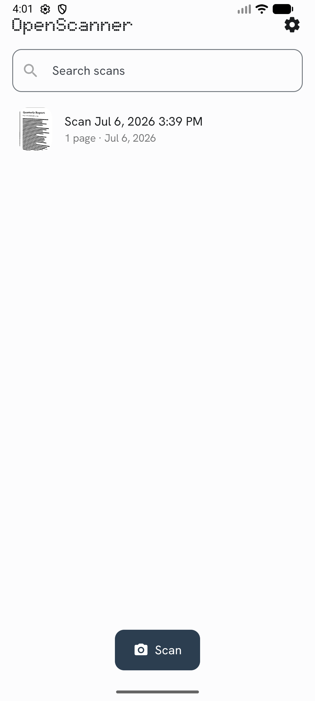
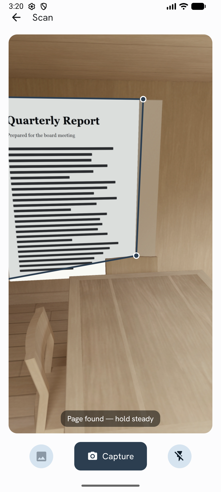
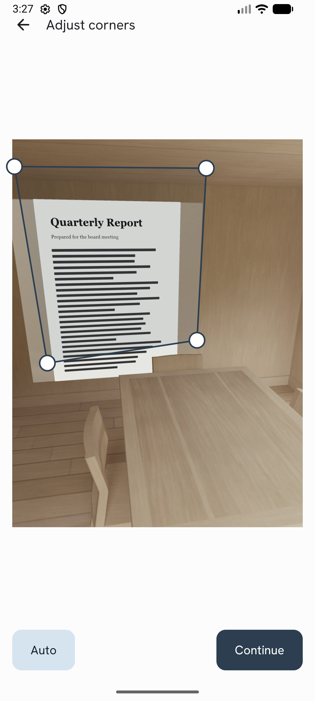
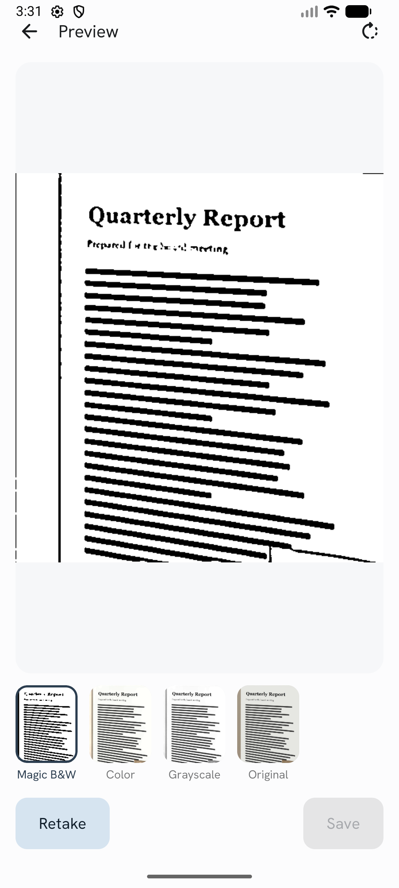
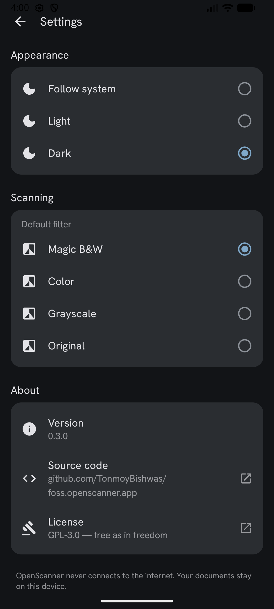

# OpenScanner

**A free and open-source document scanner for Android.** Point your camera at a page — OpenScanner finds the edges, crops it straight, and makes the text crisp black on clean white. No ads, no watermarks, no account, no cloud. Your documents never leave your device.

An open alternative to CamScanner and similar paid scanner apps.

[](https://github.com/TonmoyBishwas/foss.openscanner.app/actions/workflows/build.yml)
[](LICENSE)

## Screenshots

| Library | Live edge detection | Corner adjust | Magic filters | Dark theme |
|---|---|---|---|---|
|  |  |  |  |  |

## Download

Grab the latest APK from [GitHub Releases](https://github.com/TonmoyBishwas/foss.openscanner.app/releases) (`arm64-v8a` for most modern phones). Play Store and F-Droid listings are on the way.

## Features

- **Live edge detection** — the viewfinder highlights the four corners of the page in real time
- **Auto crop & de-skew** — capture snaps the page flat, as if it went through a real scanner
- **Magic filter** — text becomes vivid black on clean white; shadows and uneven lighting disappear
- More filters: color enhance, grayscale, original
- Multi-page documents with PDF export and sharing
- Import photos from your gallery and scan them the same way
- Manual corner adjustment with magnifier when auto-detection isn't perfect
- 100% offline — no network permission needed, nothing is uploaded anywhere

## Tech

- Kotlin + Jetpack Compose (Material 3)
- CameraX for the camera pipeline
- Hybrid page detection: the [DocAligner](https://github.com/DocsaidLab/DocAligner) neural corner model (Apache-2.0) via [ONNX Runtime](https://onnxruntime.ai/) (MIT), cross-checked and sub-pixel-refined by a classical [OpenCV](https://opencv.org/) pipeline
- OpenCV (Apache-2.0) for perspective correction and the enhancement filters
- Everything runs on-device on the CPU — no Google Play Services, no network; F-Droid friendly (see [NOTICE.md](NOTICE.md))

## Building

Requirements: JDK 17+ and the Android SDK (API 36).

```
./gradlew assembleDebug
```

The APK lands in `app/build/outputs/apk/debug/`.

For release APKs split per ABI:

```
./gradlew assembleRelease -PabiSplits
```

## Contributing

Contributions are very welcome — this project exists so that a good scanner app can belong to everyone. See [CONTRIBUTING.md](CONTRIBUTING.md).

## License

[GPL-3.0](LICENSE). The bundled fonts ([Doto](https://fonts.google.com/specimen/Doto), [Hanken Grotesk](https://fonts.google.com/specimen/Hanken+Grotesk)) are licensed under the SIL Open Font License 1.1.
